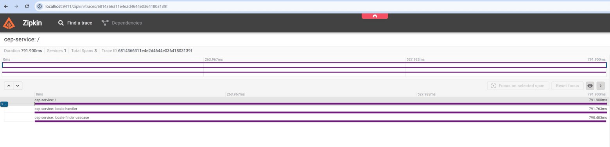

Traductions:

* [Anglais](README.md)
* [Portugais (Brésil)](README_pt_br.md)

# 🔍 Projet de Surveillance avec OpenTelemetry et Zipkin (simple-weather-otel)


Bienvenue dans le projet de surveillance avec OpenTelemetry et Zipkin ! Ce projet démontre l'utilisation d'OpenTelemetry pour la traçabilité distribuée et la surveillance des microservices en Go.

## 📑Table des Matières

- [📖 Introduction](#introduction)
- [🛠 Prérequis](#prérequis)
- [⚙️ Installation](#installation)
- [🚀 Utilisation](#utilisation)
- [🔎 Exemples de Surveillance](#exemples-de-surveillance)
- [🤝 Contribution](#contribution)
- [📜 Licence](#licence)

## 📖Introduction

OpenTelemetry est un ensemble d'outils, d'APIs et de SDKs qui peuvent être utilisés pour instrumenter, générer, collecter et exporter des données de télémétrie (telles que des métriques, des journaux et des traces) pour aider à comprendre le comportement des logiciels. Zipkin est utilisé pour collecter et visualiser ces données.

## 🛠Prérequis

Assurez-vous d'avoir les éléments suivants installés avant de continuer :

- [Docker](https://www.docker.com/get-started)
- [Docker Compose](https://docs.docker.com/compose/install/)

Modifiez le fichier `docker-compose.yaml` et ajoutez la clé API `WeatherAPI` pour demander les températures souhaitées (KEY_WEATHER_API):

- [WeatherAPI](https://www.weatherapi.com/)

## ⚙︠Installation

1. Clonez ce dépôt :

    ```sh
    git clone git@github.com:rodrigoachilles/simple-weather-otel.git
    cd simple-weather-otel
    ```

2. Exécutez Docker Compose :

    ```sh
    docker-compose up -d
    ```

3. Accédez à Zipkin à l'adresse :

   [http://localhost:9411](http://localhost:9411)

## 🚀Utilisation

Après avoir démarré Docker Compose, vous pouvez accéder à l'interface Zipkin pour surveiller les spans de vos services. Pour exécuter les services, utilisez le fichier `.http` dans le dossier `api` de `weather-service`.

### 🔧 Exécution des Services

Accédez au dossier `api` dans le répertoire `weather-service` :

    ```sh
    cd weather-service/api
    ```

Exécutez le fichier `.http` en utilisant votre outil préféré (par exemple, VSCode REST Client, Postman) :

    ```sh
    # Example for VSCode REST Client
    weather.http
    ```

Voici un exemple de la façon dont un span peut être visualisé dans Zipkin :



### 💻Exemple de Code

Voici quelques exemples de la façon dont vous pouvez instrumenter votre code Go pour envoyer des données à Zipkin en utilisant OpenTelemetry :

#### Exemple en Go

Installez les dépendances nécessaires :

```sh
go get go.opentelemetry.io/otel
go get go.opentelemetry.io/otel/exporters/zipkin
go get go.opentelemetry.io/otel/sdk/trace
```

Instrumentez votre application :

```go
package main

import (
	"go.opentelemetry.io/otel"
	"go.opentelemetry.io/otel/exporters/zipkin"
	"go.opentelemetry.io/otel/sdk/resource"
	"go.opentelemetry.io/otel/sdk/trace"
	"log"
	"os"
)

func main() {
	// Créez l'exportateur Zipkin
	exporter, err := zipkin.New(
		"http://localhost:9411/api/v2/spans",
	)
	if err != nil {
		log.Fatalf("failed to create Zipkin exporter: %v", err)
	}

	// Créez le fournisseur de traces
	tp := trace.NewTracerProvider(
		trace.WithBatcher(exporter),
		trace.WithResource(resource.NewWithAttributes(
			"service.name", "weather-service",
		)),
	)
	otel.SetTracerProvider(tp)

	// Votre code d'application ici
}
```

## 🔠Exemples de Surveillance

Voici des exemples de la façon dont les spans du `weather-service` et du `cep-service` peuvent être visualisés dans Zipkin :


## 🤠Contribution

N'hésitez pas à ouvrir des issues ou à soumettre des pull requests pour des améliorations et des corrections de bugs.

## 📜Licence

Ce projet est sous licence MIT.
