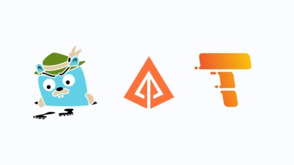
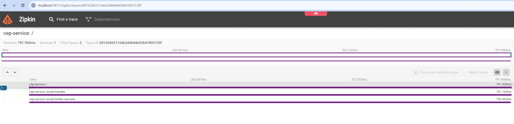
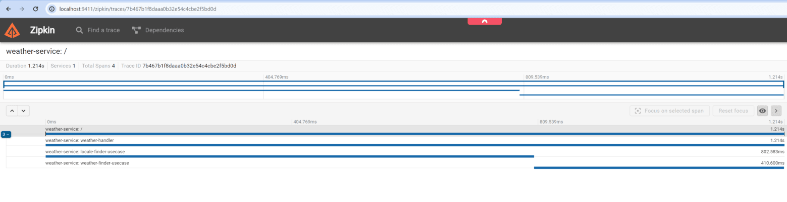

Traduções:

* [Inglês](README.md)
* [Francês](README_fr.md)

# 🔍 Projeto de Monitoramento com OpenTelemetry e Zipkin (simple-weather-otel)



Bem-vindo ao projeto de monitoramento com OpenTelemetry e Zipkin! Este projeto demonstra o uso do OpenTelemetry para rastreamento distribuído e monitoramento de microsserviços em Go.

## 📑&nbsp;Sumário

- [📖 Introdução](#introdução)
- [🛠 Pré-requisitos](#pré-requisitos)
- [⚙️ Instalação](#instalação)
- [🚀 Uso](#uso)
- [🔎 Exemplos de Monitoramento](#exemplos-de-monitoramento)
- [🤝 Contribuição](#contribuição)
- [📜 Licença](#licença)

## 📖&nbsp;Introdução

O OpenTelemetry é uma coleção de ferramentas, APIs e SDKs que podem ser usadas para instrumentar, gerar, coletar e exportar dados de telemetria (como métricas, logs e traces) para ajudar a entender o comportamento de software. O Zipkin é usado para coletar e visualizar esses dados.

## 🛠&nbsp;Pré-requisitos

Certifique-se de ter os seguintes itens instalados antes de continuar:

- [Docker](https://www.docker.com/get-started)
- [Docker Compose](https://docs.docker.com/compose/install/)

Altere o arquivo `docker-compose.yaml` e adicione a chave da API `WeatherAPI` para consultar as temperaturas desejadas (KEY_WEATHER_API): 

- [WeatherAPI](https://www.weatherapi.com/)

## ⚙️&nbsp;Instalação

1. Clone este repositório:

    ```sh
    git clone git@github.com:rodrigoachilles/simple-weather-otel.git
    cd simple-weather-otel
    ```

2. Execute o Docker Compose:

    ```sh
    docker-compose up -d
    ```

3. Acesse o Zipkin em:

   [http://localhost:9411](http://localhost:9411)

## 🚀&nbsp;Uso

Após iniciar o Docker Compose, você pode acessar a interface do Zipkin para monitorar os spans dos seus serviços. Para executar os serviços, use o arquivo `.http` na pasta `api` do `weather-service`.

### 🔧&nbsp;Executando Serviços

1. Navegue até a pasta `api` no diretório `weather-service`:

    ```sh
    cd weather-service/api
    ```

2. Execute o arquivo `.http` usando sua ferramenta preferida (por exemplo, VSCode REST Client, Postman):

    ```sh
    # Example for VSCode REST Client
    weather.http
    ```

Aqui está um exemplo de como um span pode ser visualizado no Zipkin:



### 💻&nbsp;Exemplos de Código

Aqui estão alguns exemplos de como você pode instrumentar seu código Go para enviar dados para o Zipkin usando OpenTelemetry:

#### Exemplo Go

Instale as dependências necessárias:

```sh
go get go.opentelemetry.io/otel
go get go.opentelemetry.io/otel/exporters/zipkin
go get go.opentelemetry.io/otel/sdk/trace
```

Instrua sua aplicação:

```go
package main

import (
	"go.opentelemetry.io/otel"
	"go.opentelemetry.io/otel/exporters/zipkin"
	"go.opentelemetry.io/otel/sdk/resource"
	"go.opentelemetry.io/otel/sdk/trace"
	"log"
	"os"
)

func main() {
	// Crie o exportador Zipkin
	exporter, err := zipkin.New(
		"http://localhost:9411/api/v2/spans",
	)
	if err != nil {
		log.Fatalf("failed to create Zipkin exporter: %v", err)
	}

	// Crie o provedor de trace
	tp := trace.NewTracerProvider(
		trace.WithBatcher(exporter),
		trace.WithResource(resource.NewWithAttributes(
			"service.name", "weather-service",
		)),
	)
	otel.SetTracerProvider(tp)

	// Seu código da aplicação aqui
}
```

## 🔎&nbsp;Exemplos de Monitoramento

Abaixo estão exemplos de como os spans do `weather-service` e `cep-service` podem ser visualizados no Zipkin:




## 🤝&nbsp;Contribuição

Sinta-se à vontade para abrir issues ou enviar pull requests para melhorias e correções de bugs.

## 📜&nbsp;Licença

Este projeto é licenciado sob a Licença MIT.
